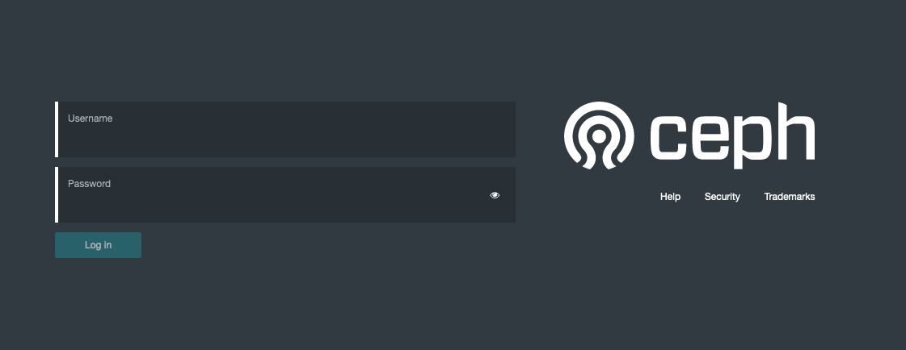

# Help file

This folder contains the necessary help to deploy the role optimally.

## Role Examples

Pay attention and take care to properly customize these files if necessary. It may be necessary to modify some parameter.

- **ansible.cfg**
  - This file is a basic example of an ansible configuration file that can be save on the runtime folder.
- **inventory**
  - This file contains the name of the hosts and the hosts groups defined in the role in order to deploy correctly.
- **deploy_kubernetes.yml**
  - This file is an example of how to launch the role.
- **requirements.yml**
  - This file is an example of how to call the role from a github repository using ansible-galaxy.

## Ceph Dashboard

If you deploy this role with Rook Ceph Storage integrated, you can use the following command to show the `admin` password in order to use the web dashboard:

`kubectl -n rook-ceph get secret rook-ceph-dashboard-password -o jsonpath="{['data']['password']}" | base64 --decode && echo`

  

